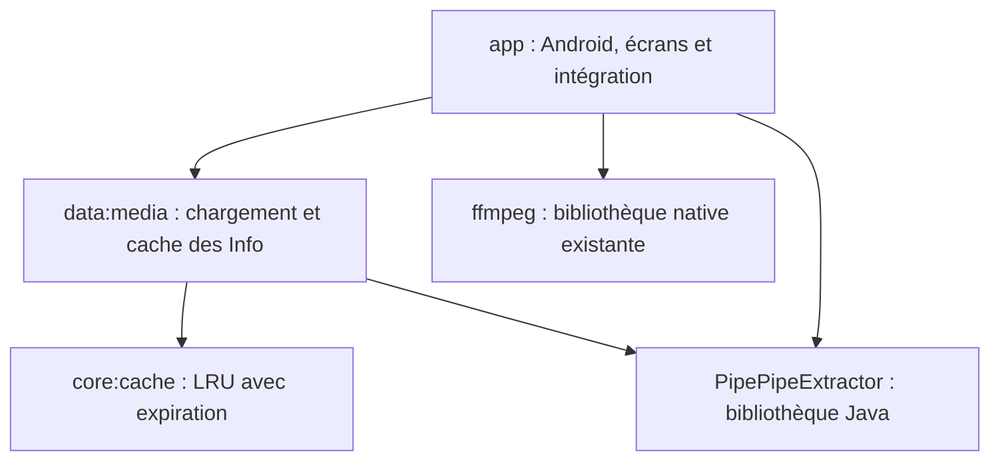

# Architecture de PipeNotPipe

## Réorganisation implémentée

`core:cache` ne dépend que de Java. Il gère la capacité, l'ordre d'utilisation, l'expiration, la suppression, la purge et les accès concurrents synchronisés. L'horloge est injectée : Android fournit une horloge monotone et les tests contrôlent le temps sans attendre.

`data:media` dépend du cache, des objets de l'extracteur et de RxJava. `InfoRepository` possède la politique de chargement : lire le cache, charger à la demande, mémoriser uniquement les succès, respecter un rafraîchissement forcé et enregistrer l'URL canonique d'un flux. Les clés structurées distinguent le service, l'URL et le type ; la concaténation historique pouvait provoquer des collisions.

`InfoCache` est l'adaptateur Android qui conserve les interfaces existantes. Il fournit l'horloge `SystemClock.elapsedRealtime` et les délais propres aux services. `ExtractorHelper` délègue désormais son chargement avec cache à ce module. Les écrans, le lecteur et les téléchargements utilisent donc la même mémoire partagée.

Les capacités héritées de 60 entrées et de purge à 30 restent en place. L'expiration intervient exactement à l'échéance ; les éléments expirés sont nettoyés avant l'éviction d'éléments valides. Le rafraîchissement forcé se produit lors de l'abonnement RxJava, et à chaque nouvel abonnement, plutôt qu'à la création de l'objet de requête.

## Configuration du fork

`config/fork.properties` centralise le nom, l'identifiant Android, la version, le dépôt de releases et les versions du SDK/JDK. Le namespace source `org.schabi.newpipe` est conservé pour éviter une migration massive des imports, de Room et des classes Android. L'identifiant installable appartient déjà au fork.

L'extracteur est inclus dans la compilation avec `includeBuild('../PipePipeExtractor')`. Gradle remplace sa dépendance Maven par les sources locales. Modifier l'extracteur agit donc sur l'APK suivant, sans publication JitPack préalable. Le groupe Maven original est conservé pour assurer cette substitution.

## Règles de dépendances

- `core` reste indépendant d'Android, de l'interface et des modèles de l'extracteur.
- `data` peut utiliser les modèles de l'extracteur, mais n'importe pas Android ou les classes de l'application.
- `app` assemble les modules et fournit les adaptations Android.
- Les tests d'un module traversent son interface publique et contrôlent les dépendances variables, notamment l'horloge et la source de chargement.

`scripts/check-architecture.ps1` vérifie ces règles sur les imports des nouveaux modules et interdit une dépendance Gradle à `app`. Le contrôle ne remplace pas un analyseur exhaustif des dépendances transitives.

## Ce qui reste dans l'application héritée

Le démarrage global, les fragments, les écrans Compose, Room, les préférences, le lecteur ExoPlayer, le téléchargement et plusieurs appels statiques à `NewPipe` restent dans `app`. Ce premier chantier isole un comportement partagé réellement utilisé ; il ne constitue pas une réécriture complète de ces domaines.

Pour la suite : isoler d'abord les accès Room et préférences dans `data:library`, puis les règles de file d'attente dans `core:playback`, puis les écrans par fonctionnalités. Chaque extraction doit déplacer un comportement et ses tests avant d'ajouter un nouveau module. Les appels d'extraction sans cache, notamment la pagination, restent actuellement dans `ExtractorHelper`.

## Limites connues

Les objets `Info` sont des modèles mutables de l'extracteur. Deux extractions simultanées d'une même URL peuvent encore effectuer deux requêtes : le module n'ajoute pas de déduplication des requêtes en cours. L'invalidation forcée retire la clé demandée, comme dans le code d'origine ; elle ne supprime pas tous les alias canoniques associés.

Le code hérité possède une dette Lint importante. La validation locale initiale a produit 1 213 erreurs, 536 avertissements et une indication avec le réglage non bloquant hérité. Les 15 tests des nouveaux modules passent. Les rapports exacts sont dans `PipePipeClient/app/build/reports/`. Une installation sur appareil et les extractions de flux en direct doivent être vérifiées séparément.
